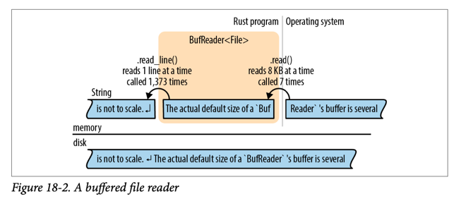

buffered file reader
- pic not to scale because default size is several KB
- a single read can serve 100s of read_line()
- this matters because sys calls are slow.
- OS has its own buffer too because reading data from disk is even slower than syscall.