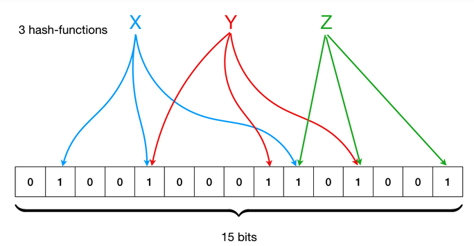

# Bloom Filter

Refs
- https://avi.im/blag/2024/sqlite-past-present-future/
- https://github.com/facebook/rocksdb/wiki/RocksDB-Bloom-Filter
- https://github.com/facebook/rocksdb/issues/4120
- https://brilliant.org/wiki/bloom-filter/
- https://ilyasergey.net/YSC2229/week-07-bloom.html

Bloom filter usages
- Google Bigtable: Uses Bloom filters to reduce disk lookups for non-existent rows or columns.
- Apache HBase: Employs Bloom filters for the same reason as Bigtable [1, 4].
- Apache Cassandra: Uses Bloom filters to avoid unnecessary disk I/O operations when querying for data that doesn't exist.
- ScyllaDB: Similar to Cassandra and HBase, ScyllaDB uses Bloom filters to optimize database query performance.
- PostgreSQL: Uses Bloom filters to reduce disk lookups.
- Google Chrome: Previously used a Bloom filter to identify malicious URLs [1, 2].
- Microsoft Bing: Uses multi-level hierarchical Bloom filters for its search index, BitFunnel.
- Redis: Uses Bloom Filters to potentially skip database lookups.

## Double hashing

Problem
- Bloom filters use multiple hash functions to map a key to multiple positions in a bit array.
- Generating truly independent hash functions can be computationally expensive or require a lot of storage for the function seeds.
- If the hash functions are correlated, it can lead to higher false positive rates than theoretically predicted.

Solution: `double hashing`
- Double hashing is a technique to simulate multiple independent hash functions using only two hash functions, h1(x) and h2(x).
- It generates subsequent hash functions by combining the two initial hash functions in the form `gi(x) = h1(x) + i * h2(x)`, where i ranges from 0 to k-1.

Result
- reduced correlation.
- uniform distribution across bit array -> efficiently used the array.

Example



- Bloom filter with a bit array of size m = 10, and we want to use k = 3 hash functions.
- Two base hash functions: `h1(x) = x mod 10` and `h2(x) = (x/10) mod 10`
- Add `key=123` to bloom filter
```
# compute hash values for 3 probes (hash functions)
g0(123) = (123 mod 10 + 0 * (123/10) mod 10) mod 10 = 3 mod 10 = 3
g1(123) = (123 mod 10 + 1 * (123/10) mod 10) mod 10 = (3+1*2) mod 10 = 5 mod 10 = 5
g2(123) = (123 mod 10 + 2 * (123/10) mod 10) mod 10 = (3+2*2) mod 10 = 7 mod 10 = 7

indices = (3, 5, 7)
# set bits at positions 3, 5, 7 of bit array
```
- To check if 123 is in filter
  - compute same `indices` and check if they are all set in array.
  - if no, they are definitely not in the array.
  - if yes, they might be in the array (false positive possible).

Ref
- https://www.eecs.harvard.edu/~michaelm/postscripts/tr-02-05.pdf


