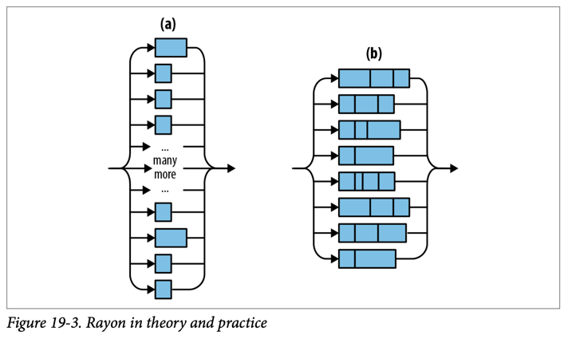
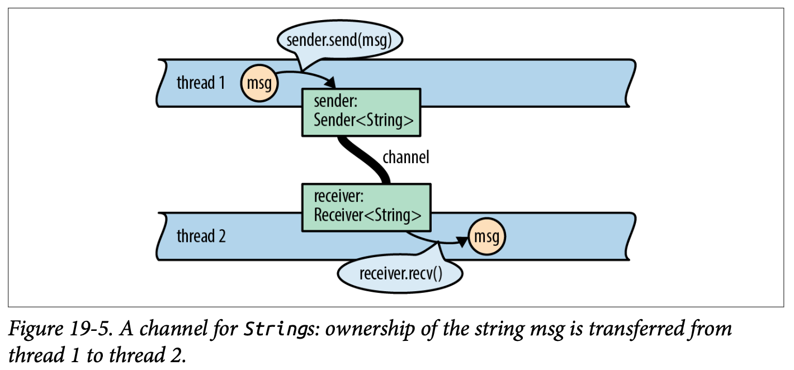
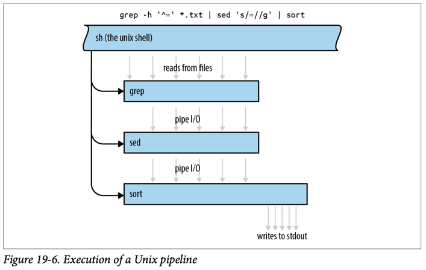
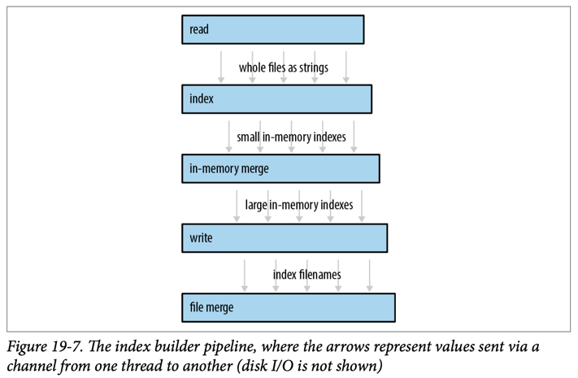
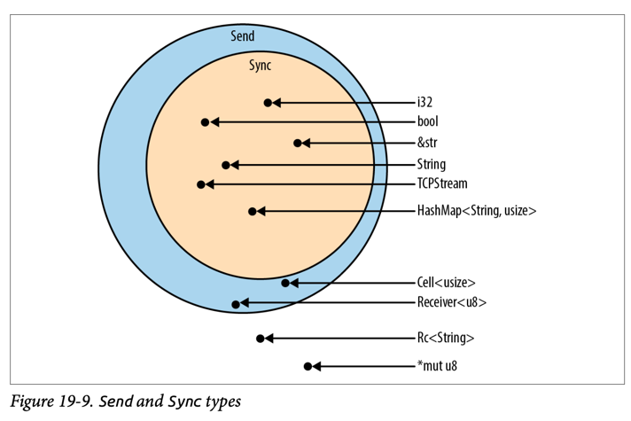
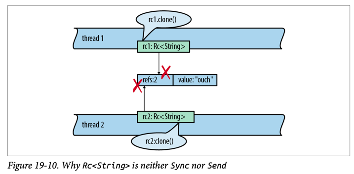
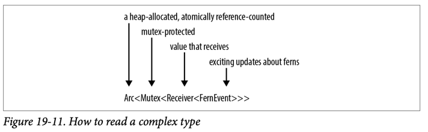

3 techniques for using threads
1. fork join
2. channel
3. shared mutable state with locks

## Fork-Join Parallelism



## Channels





Rust channels are faster than Unix pipes. 
- Sending a value `moves it rather than copying it`, 
- moves are fast even when you’re moving data structures that contain many megabytes of data.





Thread safety
- `Send`: safe to pass by value to another thread
- `Sync`: safe to pass by non-mut ref to another thread



Why `Rc<String>` not `Sync` nor `Send`?
- What would happen if Rc<String> were Sync?
  - allowing threads to share a single Rc via shared references.
  - If both threads happen to try to clone the Rc at the same time, as shown in Figure 19-10, we have a data race as both threads increment the shared reference count.

## Shared Mutable State

```
1. Mutex
2. RwLock<T>
3. Condvar
4. Atomic
```



